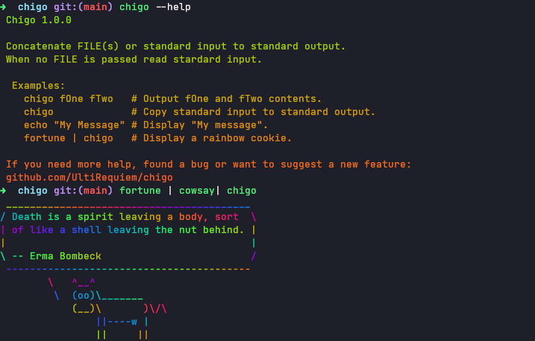

# Chigo 🦄

[](https://goreportcard.com/report/github.com/UltiRequiem/chigo)
[](https://pkg.go.dev/github.com/UltiRequiem/chigo/pkg)

[Lolcat](https://github.com/busyloop/lolcat) port for Golang 🌈

## Showcase



[Video](https://youtu.be/4Bc-aBfjxwY) 📹

## Installation

```sh
go install github.com/UltiRequiem/chigo@latest
```

Or use a binary from
[releases](https://github.com/UltiRequiem/chigo/releases/latest).

## Documentation

It also exports utils to output with colors in your own CLI Tools.

```go
package main

import (
        "fmt"
	chigo "github.com/UltiRequiem/chigo/pkg"
)

func main() {
	fmt.Println(chigo.Colorize("Hello, World!"))
}
```

> [A more complete example](https://github.com/UltiRequiem/lorelai/tree/main/cmd/utils.go)
> 🕵️‍♂️

[Autogenerated docs](https://pkg.go.dev/github.com/UltiRequiem/chigo/pkg) 📑

[I also made a blog about this project](https://blog.ultirequiem.com/chigo) 🚀

## Support

Open an Issue, I will check it a soon as possible 👀

If you want to hurry me up a bit
[send me a tweet](https://twitter.com/UltiRequiem) 😆

Consider [supporting me on Patreon](https://patreon.com/UltiRequiem) if you like
my work 🚀

Don't forget to star the repo ⭐

## Versioning

We use [Semantic Versioning](http://semver.org). For the versions available, see
the [tags](https://github.com/UltiRequiem/chigo/tags) 🏷️

## Authors

[Eliaz Bobadilla (a.k.a UltiRequiem)](https://ultirequiem.com) - Creator and
Maintainer 💪

See also the full list of
[contributors](https://github.com/UltiRequiem/chigo/contributors) who
participated in this project.

## Licence

Licensed under the MIT License 📄
